# 💰 Personal Expenses Tracker

A web application to help users manage and track their personal expenses. The tracker allows users to create, edit, and categorize expenses, set budgets, and view detailed reports and visualizations of their spending habits.
---
## Features
- Add, edit, and delete transaction (income, expenses)
- Categorize expenses (e.g., Food, Travel, Utilities, etc.)
- Set budgets for each category
- View spending trends with charts
- Secure user authentication and data storage
---
#  Technologies Used
- **Frontend:** React.js with Vite.js
- **Backend:** Node.js with Express
- **Database:** MySQL
- **Styling:** CSS and Material-UI Components
- **Build Tool:** Vite.js
- **Styling:** CSS and Material UI
---
# Application Screenshots
1. User Authentication (Login, Sign Up, Verification, Forgot Password)
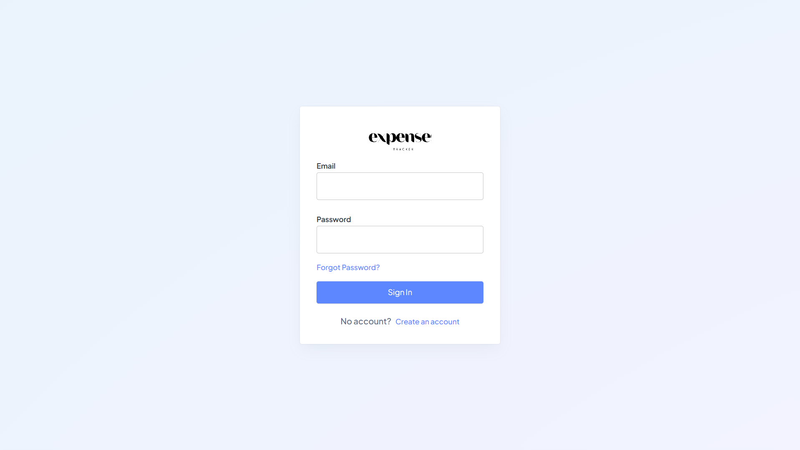
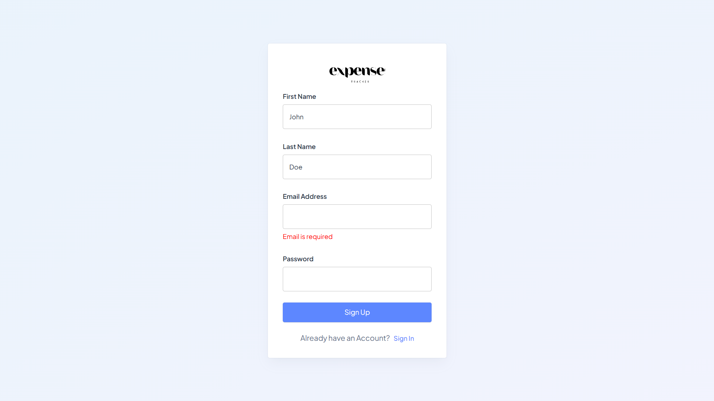

3. Dashboard
User can filter the chart to view their transaction within 12 months.
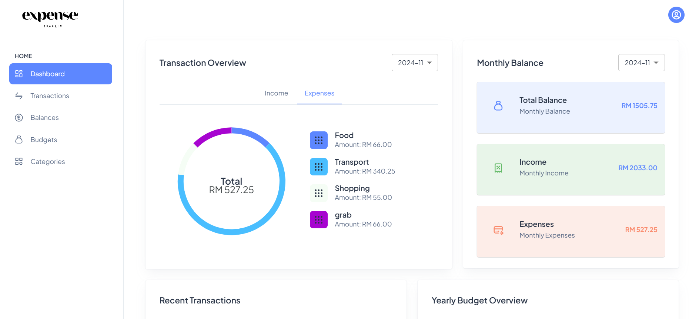

4. Transaction
- User can view their transaction and filter the transaction by month.
  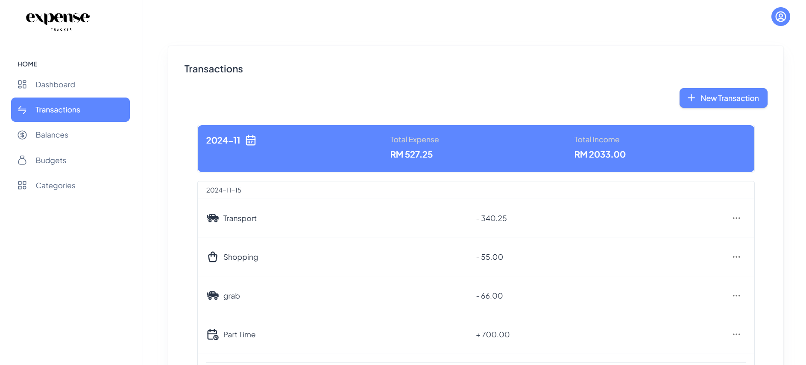
  
- User can add/ edit/ delete income or expenses
  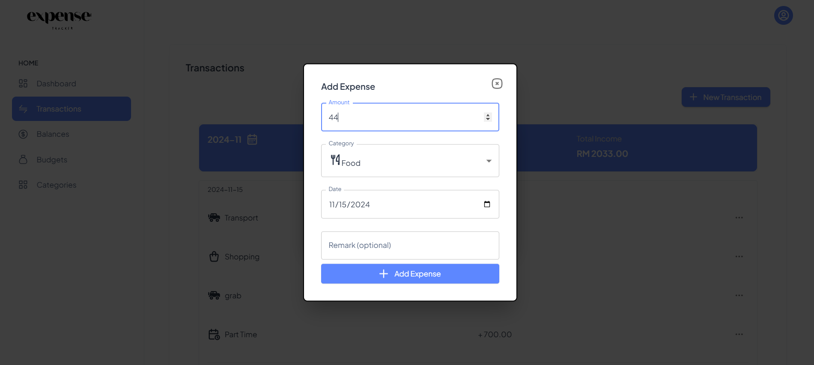

5. Balance Page
- This page shows the monthly balances.
   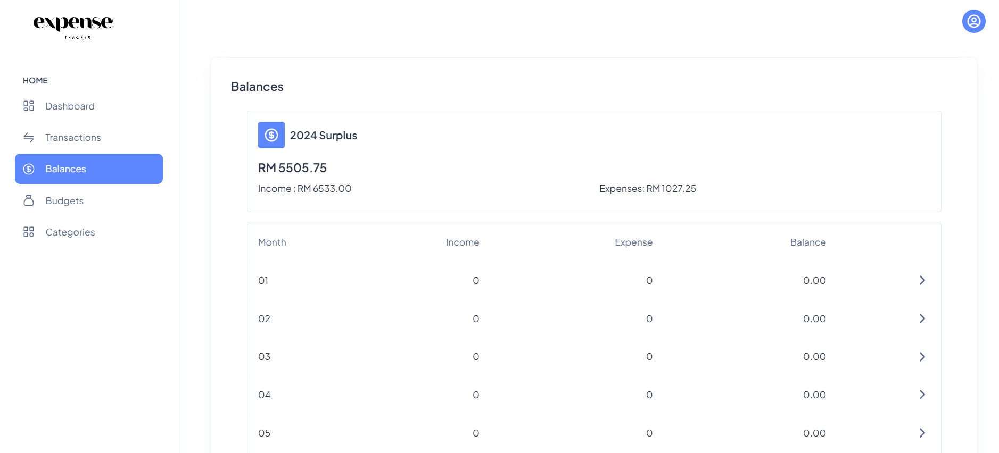

6. Budget
- Overview of yearly Budget
  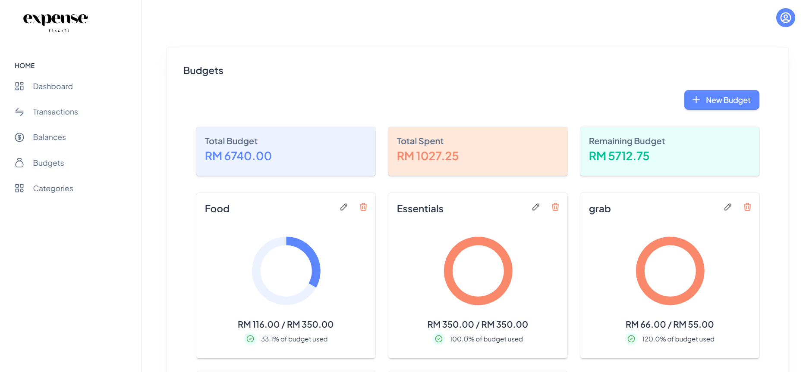
  
- Add/ Edit/ Delete Budgets
  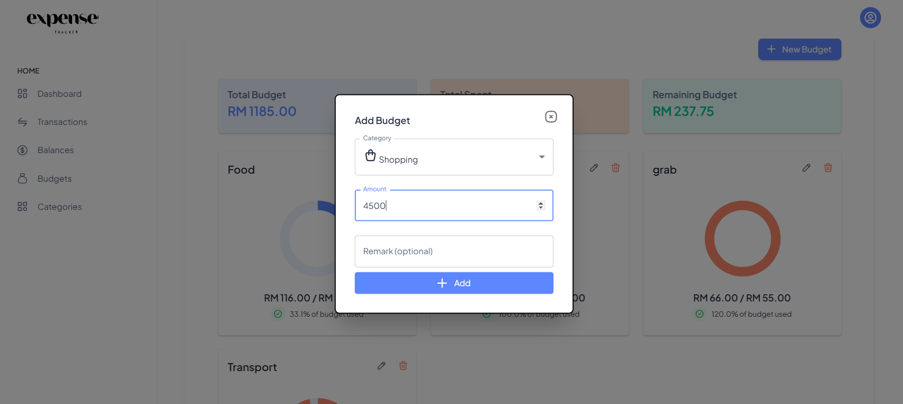

7. Category
- Manage Category
  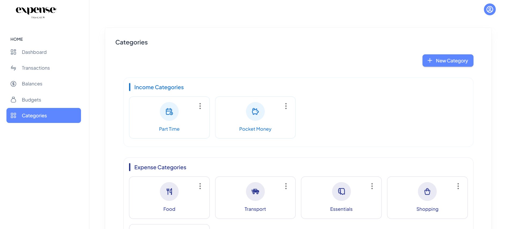

- Add/ Edit/ Delete Category
  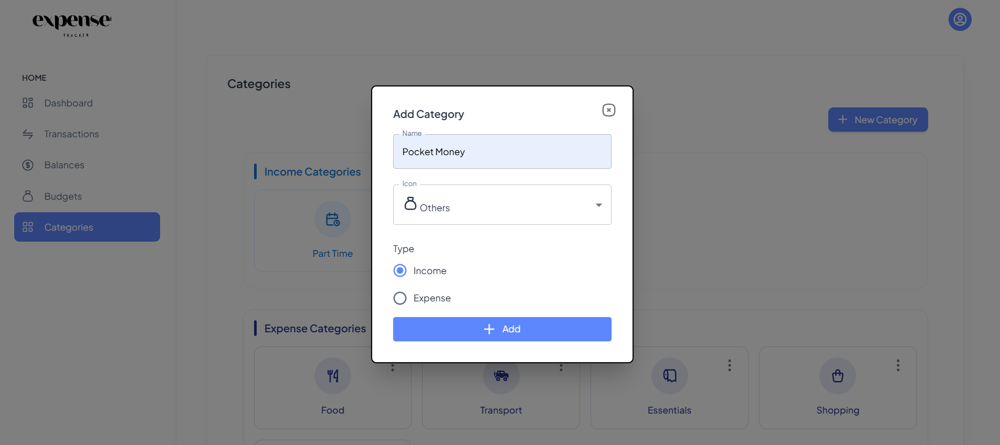

- When user want to delete a Category, they can transfer their transaction to other category, else the transaction data will be deleted.
  - Choose Data to transfer
  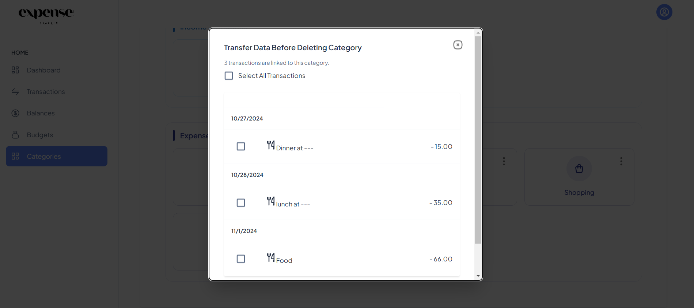
  - Choose Category to transfer the data
  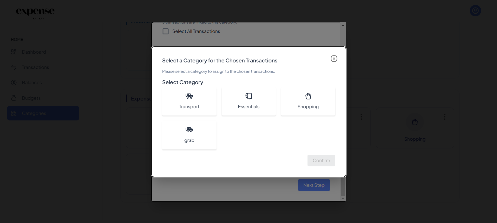

---
## 📚 Getting Started
### Prerequisites
- Node.js (v14 or later)
- MySQL (v8 or later)
- Git

### Installation
1. Clone the repository
2. Install Dependencies
   ```bash
    cd client  
    npm install  
    cd ../server  
    npm install
3.  Create a MySQL database and configure the connection in server/config/db.js.
4.  Start the application:
   ```bash
    # Start the backend server  
    cd server  
    npm start  
    
    # Start the frontend  
    cd ../client  
    npm run dev

---
🌟 Thank you!


