# Personal Expenses Tracker

A full-stack web application for managing personal finances. Track income and expenses, set budgets per category, and visualise spending trends with interactive charts.

[](https://expenses-tracker-five-sooty.vercel.app/auth/login)

---

## Features

- User authentication — register, login, forgot password
- Add, edit, and delete transactions (income & expenses)
- Organise transactions by custom categories with icons
- Set budgets per category and track spending against them
- Monthly and yearly balance overview with colour-coded summaries
- Interactive charts for spending trends and budget breakdowns
- Mobile-responsive UI

---

## Tech Stack

| Layer     | Technology                              |
|-----------|-----------------------------------------|
| Frontend  | React 18, Vite, Material UI v5, ApexCharts |
| Backend   | Node.js, Express                        |
| Database  | PostgreSQL with Sequelize ORM           |
| Auth      | JWT, bcrypt                             |

---

## Screenshots

### Authentication
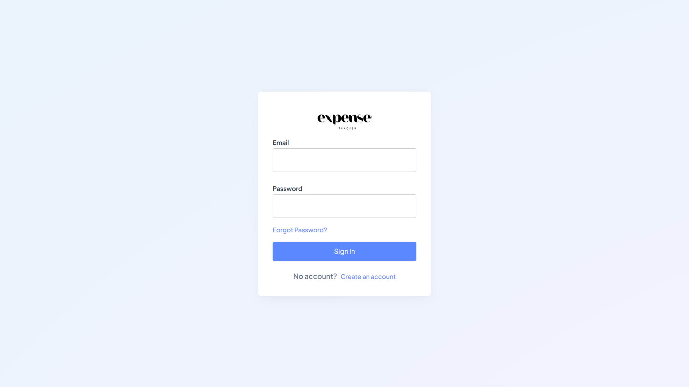
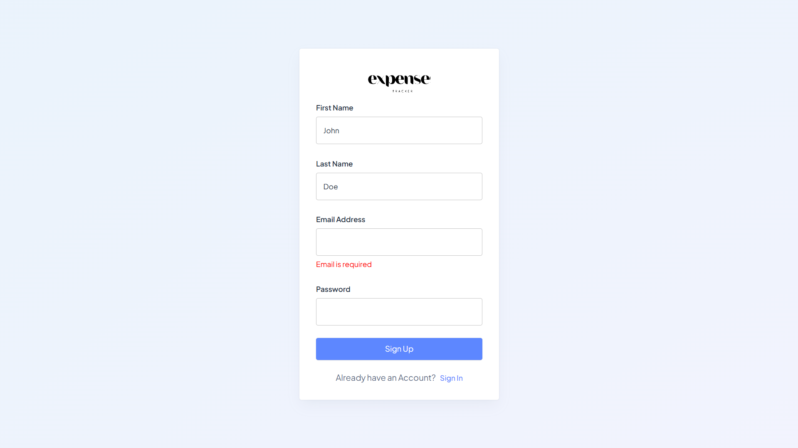

### Dashboard
User can filter the chart to view transactions within the last 12 months.
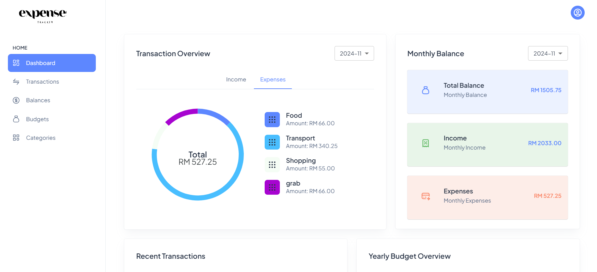

### Transactions
View and filter transactions by month.
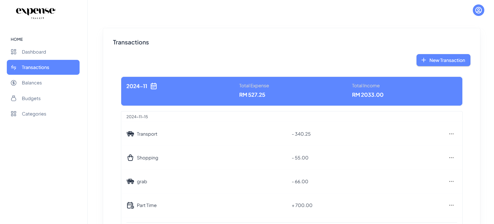

Add / edit / delete income or expenses.
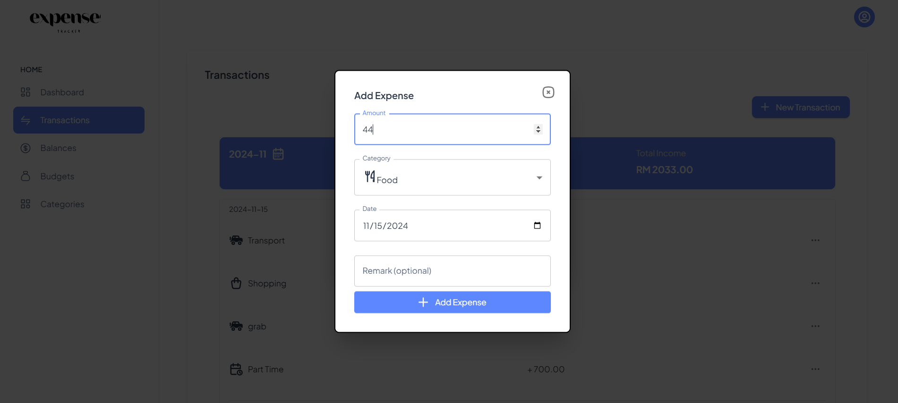

### Yearly Balance
Monthly breakdown of income, expenses, and balance for the current year.
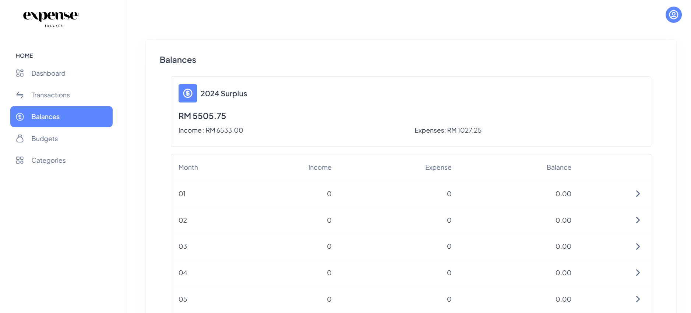

### Budgets
Overview of all budgets with spending progress.
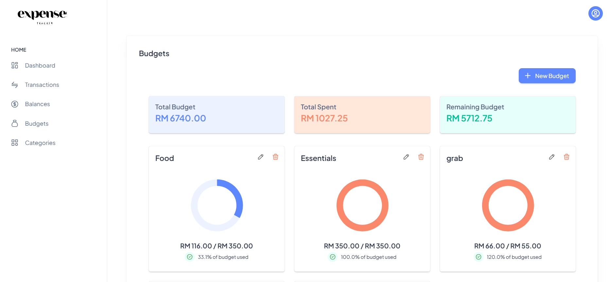

Add / edit / delete budgets.
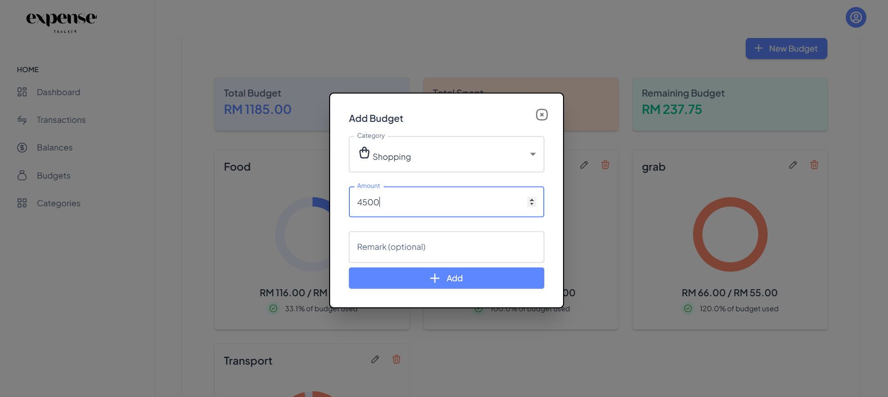

### Categories
Manage expense and income categories.
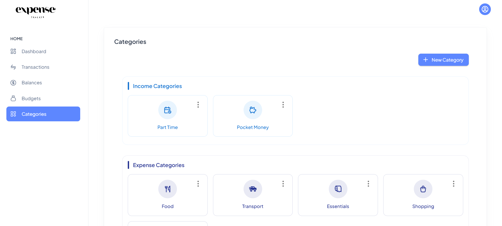

Add / edit / delete categories.
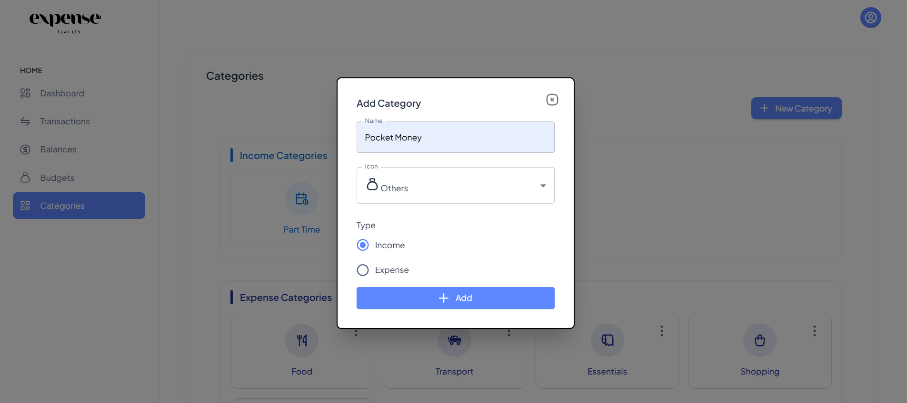

When deleting a category that has transactions, you can transfer those transactions to another category before deleting.
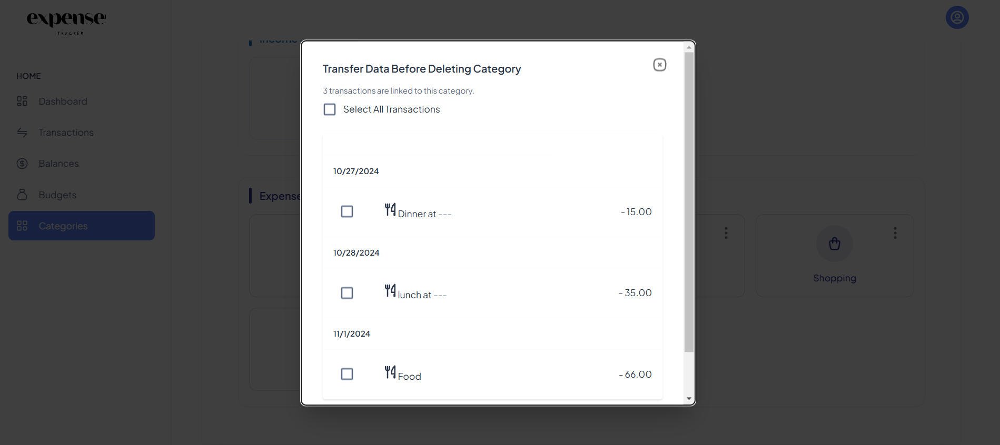
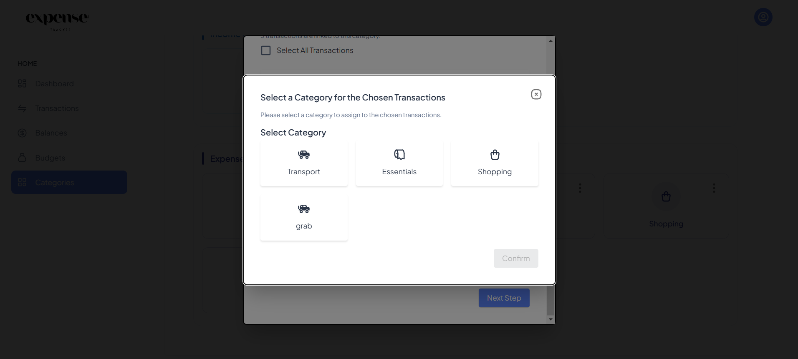

---

## Getting Started

### Prerequisites

- Node.js v14+
- PostgreSQL v13+
- Git

### 1. Clone the repository

```bash
git clone <repo-url>
cd ExpensesTracker
```

### 2. Configure the server environment

Create `server/.env`:

```env
NODE_ENV=development
PORT=3001

# JWT
JWT_SECRET=your-secret-key

# Client origin (for CORS)
CLIENT_URL=http://localhost:5173

# Database
DB_USERNAME=your_db_user
DB_PASSWORD=your_db_password
DB_DATABASE=petdb
DB_HOST=127.0.0.1
DB_PORT=5432
DB_DIALECT=postgres
```

### 3. Install dependencies

```bash
# Backend
cd server
npm install

# Frontend
cd ../client
npm install
```

### 4. Set up the database

```bash
cd server
npx sequelize-cli db:migrate
```

### 5. Start the application

```bash
# Start the backend (from server/)
npm start

# Start the frontend (from client/)
npm run dev
```

The app will be available at `http://localhost:5173`.

---

## Project Structure

```
ExpensesTracker/
├── client/          # React frontend (Vite)
│   └── src/
│       ├── views/   # Page components
│       ├── components/
│       └── helpers/
└── server/          # Express backend
    ├── controllers/
    ├── models/
    ├── routes/
    └── services/
```
